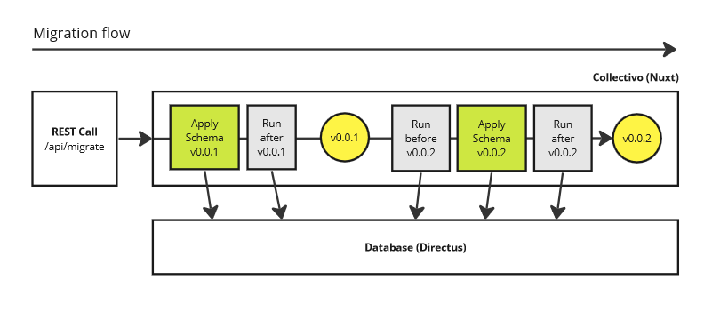

# Developer guide

## Overview

The repository is structured as follows:

- collectivo - Modular frontend & Nuxt API for migrations
  - app - A container to run collectivo
  - collectivo - Core functionalities
  - extensions - Optional modules
    - memberships - Manage memberships of an organization
- directus - Database, REST/GraphQL API, & Admin app
- keycloak - Authentication

## Installation

Follow the instructions under [getting started](quickstart.md).

## Configuration

The main settings of Collectivo can be configured in `collectivo/app.config.ts`.

## Add an extension

To add an extension to Collectivo, add the name of the package in `package.json` and `nuxt.config.ts`. For more information, see [Nuxt Layers](https://nuxt.com/docs/guide/going-further/layers).

## Develop custom features

You can adapt the Nuxt app in `/collectivo` to add your own custom functionality. To do so, create your own [fork](https://docs.github.com/en/pull-requests/collaborating-with-pull-requests/working-with-forks/fork-a-repo) of this repository.

For further information, please see the [development guide](https://github.com/collectivo-dev/collectivo#development-guide).

## Publish your features as an extension

You can share your custom functionality with others by creating an extension of Collectivo as an npm package.

To do so, configure the name, version, author, and license in [`collectivo/package.json`](https://docs.npmjs.com/cli/v6/configuring-npm/package-json) and set `private:false`.

Then, change the name of your extension in [registerExtension.ts](https://github.com/collectivo-dev/collectivo#creating-an-extension).

Finally, publish your extension on npm.

```sh
pnpm publish -r --access=public
```

## Deploy to a server

To deploy Collectivo on a server, make sure to generate a new client secret in Keycloak and set fresh secrets in `.env`.

A template for the Collectivo container can be found in `docker-compose.yml`.

You further need to set up a reverse proxy system and SSH certificates to make your instance of Collectivo publicly accessible.

A working example of a deployment setup can be found in [mila-server](https://github.com/MILA-Wien/mila-server).

## Configuration

- Internationalization (see [nuxt/i18n](https://i18n.nuxtjs.org/))
  - Change the default language: add `i18n: {defaultLocale: 'en'}` to `nuxt.config.ts`.

## Migrations

Migrations between schemas can be run via the Nuxt API endpoint `/api/migrate/`. Extensions can define a schema for each version. E.g. a schema can be for version `0.0.1` of the core extension `collectivo`. A migration script can be run both before and after applying each schema version.



Migration requests must be authorized with the `NUXT_API_TOKEN` from `.env`.

The following parameters can be passed:

- `extension (string)` - Apply migrations of a specific extension. If not given, all extensions will be migrated.
- `version (string)` - Apply schemas towards specified version. If not given, migration will run up to the latest version.
- `examples (boolean)` - Create example data (default false).
- `isolated (boolean)` - Apply only the specified schema (if version is passed) or example data (if no version passed).

Here is an example to prepare a new system for local development (the same code is run by `pnpm seed`):

```sh
curl --header "Authorization: badToken" --request POST "http://localhost:3000/api/migrate/?examples=true"
```

This cURL command can also imported in an HTTP client like [Postman](https://www.postman.com/).

Migration logs can be found in the nuxt terminal.

## Troubleshooting

- To reset the database, delete the volume of the directus-db database

## Creating an extension

To get started, create a fork of the [Collectivo Quickstart](https://github.com/collectivo-dev/collectivo-quickstart) repository.

## Adding a database schema

An extension can define a database schema

- Create a new schema file in `myExtension/server/schemas`.
  - Create a new [`ExtensionSchema`](#extensionschema) with [initschema()](#initschema).
  - Add collections, fields, and more to your schema (see [`ExtensionSchema`](#extensionschema))
- Add your schema to [myExtension/server/plugins/setup](#registerextension).

Note that database collections and fields should start with the name of the extension followed by an underscore to avoid name conflicts with other extensions. E.g. `myExtension_myCollection` and `myExtension_myField`.

Exceptions are the following system fields:

- `id`
- `user_created`
- `user_updated`
- `date_created`
- `date_updated`
- `sort`

## Best practices

- Regularly [sync your fork](https://docs.github.com/en/pull-requests/collaborating-with-pull-requests/working-with-forks/syncing-a-fork) with the upstream repository.
- To update dependencies, run `pnpm update collectivo/extensions/my-extension -L`
- You can also add fields to collections that are not part of your extensions, like `directus_users`.
- To publish your extension, run `pnpm publish collectivo/extensions/my-extension --access=public --dry-run` (remove `--dry-run` after checking that everything is correct)
- The example extension is licensed under [public domain](https://de.wikipedia.org/wiki/Unlicense). You can choose your own license for your extension, it does not have to be the same as collectivo.

## Unit testing

- To run unit tests, use: `pnpm test`

## Linting

- To run linting checks, use: `pnpm lint`
- To apply linting to all files, use: `pnpm lint:fix`

## Formatting

- To run formatting checks, use: `pnpm format`
- To apply formatting to all files, use: `pnpm format:fix`

## Workspace

Collectivo uses a [pnpm workspace](https://pnpm.io/workspaces) to manage multiple packages in a single repository. This allows you to declare dependencies to other packages in the workspace with `package-name: "workspace:*"`. If you publish your package, the workspace `"workspace:*"` will be replaced with the current version of the depedency.

## Theme

Collectivo uses [`tailwindcss`](https://tailwindcss.com/) and [`nuxt-ui`](https://ui.nuxt.com/) for styling and components. The theme can be adapted in `tailwind.config.ts` and `app.config.ts`.

## Authentication

Collectivo authenticated through directus. To protect pages, add the following middleware to the setup script. If keycloak is used, this will forward people directly to keycloak, using Directus' [seamless SSO](https://docs.directus.io/self-hosted/sso.html#seamless-sso) feature.

```ts
definePageMeta({
  middleware: ["auth"],
});
```

## Types

To add types to the database schema of the directus client, add a file `your-extension/index.d.ts` with the following content:

```ts
declare global {
  interface CollectivoSchema {
    example_collection: ExampleCollection[];
  }

  interface ExampleCollection {
    id: number;
    example_field: string;
  }
}

export {};
```

You can then enjoy type checking when using directus:

```ts
const directus = useDirectus();
const data = await directus.request(readItems("example_collection"));
```

Typescript will then know that data is a `ExampleCollection[]` and that `data[0].example_field` is a string.

## Icons

Collectivo uses [`nuxt-ui`](https://ui.nuxt.com/getting-started/theming#icons) and [`Iconify`](https://iconify.design/) to load icons. They have to be defined as `i-{collection_name}-{icon_name}`. By default, Collectivo uses the [HeroIcons](https://icones.js.org/collection/heroicons) library. Additional libraries can be loaded in [`nuxt.config.ts`](https://ui.nuxt.com/getting-started/theming#icons).

## Dashboard

You can create custom components that can be displayed inside a dashboard tile. To do so, create a new component file `components/global/`. Then, add a new dashboard tile to your database and set the field `Component` to the name of your tile.
